# DB-01 核心数据库 ERD

数据源：[schema.prisma](../../packages/database/prisma/schema.prisma)；Migration：[20260826120000_init](../../packages/database/prisma/migrations/20260826120000_init/migration.sql)；种子字典：[seed.sql](../../packages/database/prisma/seed.sql)。

## 1. 实体关系图（核心关系）

```mermaid
erDiagram
    customers ||--o{ sites : "1:N"
    customers ||--o{ devices : "分配后 1:N"
    sites ||--o{ devices : "1:N"
    customers ||--o{ contracts : "1:N"
    contracts ||--o{ contract_devices : "1:N"
    devices ||--o{ contract_devices : "1:N（时间不重叠）"
    users ||--o{ user_roles : "M:N"
    roles ||--o{ user_roles : "M:N"
    users ||--o{ user_scopes : "1:N"
    devices ||--o{ device_assignments : "1:N（仅一条 ACTIVE）"
    devices ||--o{ device_state_history : "1:N（追加）"
    devices ||--o{ device_certificates : "1:N"
    devices ||--o{ onboarding_requests : "申请"
    onboarding_requests ||--o{ onboarding_proof_nonces : "轮询防重放"
    devices ||--o{ licenses : "1:N（仅一个有效）"
    licenses ||--o{ license_entitlements : "1:N"
    licenses ||--o{ license_history : "1:N（追加）"
    device_configurations ||--o{ configuration_versions : "1:N"
    device_users ||--o{ device_user_assignments : "M:N device"
    devices ||--|| device_latest_state : "1:1"
    devices ||--o{ telemetry_hourly : "1:N"
    devices ||--o{ telemetry_daily : "1:N"
    devices ||--o{ consumable_projections : "每耗材 1 条"
    devices ||--o{ consumable_requests : "1:N"
    esg_calculation_versions ||--o{ esg_reports : "版本追溯"
    esg_calculation_versions ||--o{ esg_daily_summary : "版本追溯"
    devices ||--o{ esg_reports : "1:N"
    devices ||--o{ alarms : "1:N"
    devices ||--o{ device_events : "1:N"
    devices ||--o{ tamper_events : "1:N"
    devices ||--o{ device_commands : "1:N"
    device_commands ||--o{ command_attempts : "1:N"
    device_commands ||--o{ command_acks : "1:N"
    firmware_packages ||--o{ ota_campaigns : "1:N"
    ota_campaigns ||--o{ ota_targets : "1:N"
    ota_targets ||--o{ ota_status_history : "1:N（追加）"
    media_upload_sessions ||--o| media_objects : "1:1"
    devices ||--o{ media_objects : "1:N"
```



可靠性管线表（`ingestion_receipts`、`ingestion_gaps`、`outbox_events`、`replay_jobs`）与 `audit_logs` 无业务外键，按设计独立追加。

## 2. 关键约束实现对照

| 约束 | 实现 |
|---|---|
| `devices.device_id` / `serial_number` 唯一 | 主键 + 唯一约束（Prisma） |
| 幂等键唯一 | `ingestion_receipts.idempotency_key` UNIQUE（Prisma） |
| 一个设备仅一个有效许可证 | 部分唯一索引 `licenses_one_valid_per_device WHERE status IN ('Issued','Active','ExpiringSoon','Renewed')`（自定义 SQL） |
| Customer 与业务归属一致 | Customer 业务表直接 `customer_id` 外键；Device/Site、Assignment、ContractDevice、License 等通过外键与一致性触发器拒绝孤儿或跨 Customer 组合 |
| 有效 Contract 关联时间不重叠 | 排他约束 `contract_devices_no_overlap`（btree_gist + tstzrange，自定义 SQL） |
| 合约 startAt < endAt | CHECK `contracts_valid_period`（自定义 SQL） |
| 非法耗材类型/请求状态/百分比 | CHECK（DEC-008 封闭集合 CARBON_FILTER/BIO_ADDITIVE；状态 PENDING/PROCESSING/COMPLETED/CANCELLED；百分比 0~100，NULL=未知） |
| 每设备仅一条 ACTIVE 分配 / 设备用户授权 | 部分唯一索引（自定义 SQL） |
| 同序列号仅一条 PENDING Onboarding | 部分唯一索引（自定义 SQL） |
| 双轴设备状态历史 | `device_state_history.axis` 使用封闭枚举 `lifecycle/operational` 且非空；所有状态迁移消费者持久化领域 effect 的 axis |
| audit_logs 只追加 | 无 updated_at/触发器写入路径；UPDATE/DELETE 禁止由 DB-02 Repository 策略与 DOM-03 审计服务强制 |
| UTC | 全部时间列 `TIMESTAMPTZ`（日期列为 `DATE`，UTC 口径） |
| 原始 Telemetry 不建长期表 | 仅 `telemetry_hourly` / `telemetry_daily` 聚合表（测试断言） |

## 3. 状态机字段（初始枚举，迁移只能经领域服务）

- Device.lifecycleStatus：`PendingOnboarding | Rejected | OnboardingApproved | Onboarded | Assigned | Licensed | Active | Maintenance | Suspended | Retired`（Maintenance 为 DEC-001 冻结的独立状态）
- License.status：`Draft | Issued | Active | ExpiringSoon | Renewed | Expired | Revoked`
- DeviceCommand.status：`CREATED | AUTHORIZED | PUBLISHED | ACKNOWLEDGED | SUCCEEDED | FAILED | TIMED_OUT | CANCELLED`
- ConsumableRequest.status：`PENDING | PROCESSING | COMPLETED | CANCELLED`
- DeviceStateHistory.axis：`lifecycle | operational`；2026-09-05 前无法无歧义恢复轴的旧记录由 Migration 保守回填为 `lifecycle`。

## 4. 复验命令

```bash
pnpm --filter @fdp/database db:validate   # Schema 结构校验
pnpm check:migrations                     # Migration 结构、快照和 Prisma 最终结构漂移门禁（ENG-02）
pnpm exec vitest run packages/database    # 数据库约束验收（PGlite 真实 PostgreSQL）
pnpm --filter @fdp/database db:generate   # 生成 Prisma Client（输出 src/generated，不入库）
pnpm --filter @fdp/database db:seed       # 种子字典（需 DATABASE_URL，幂等）
```

精确测试数量与双环境复验结果见[2026-09-05 P2 整改证据报告](../audit/ENG-DB-DOM-P2证据与文档维护报告-2026-09-05.md)。
